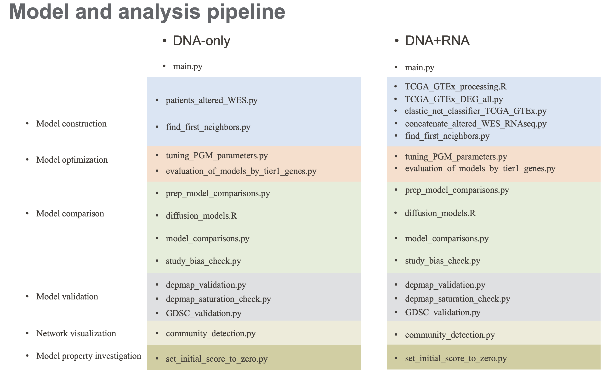

# A3D3a's MVP

A novel graph-based, cooperativity-led Markov chain model, A3D3a’s MVP (Adaptive AI-Augmented Drug Discovery and Development Molecular Vulnerability Picker), to identify and prioritize key druggable molecular vulnerabilities in cancer.

Here provide code for producing the results in the manuscript.

# Workflow

# Pipeline explanation

